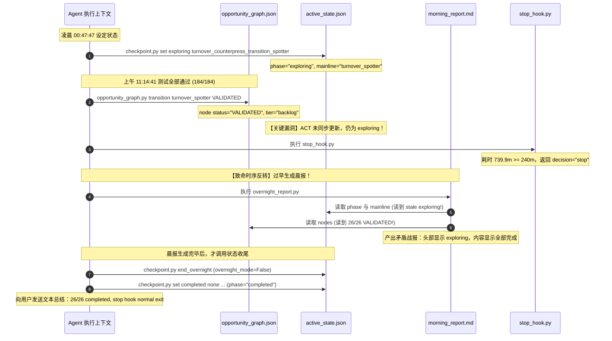

# 🔍 Lifecycle State Consistency Audit: `session_night_20260920`

**审计执行时间**: 2026-09-20 12:05:00 (+12:00) / 2026-09-20 00:05:00 UTC  
**目标会话**: `session_night_20260920`  
**审计目标**: 彻查持久化状态冲突（Report 顶部显示 `exploring` 与总结声称 `26/26 completed / budget exhausted` 的分裂现象），回答 7 项核心问题，完成系统状态溯源与最小修复诊断。  
**审计准则**: 不做盲目推测，不修改任何业务/测试代码，不预先宣布 v5.3 成功，完全基于持久化文件与源码逻辑。

---

## Executive Summary (核心结论摘要)

1. **核心矛盾根因（Split-Brain 状态分裂）**:
   状态冲突的根因是 **异步时序反转与双重数据源不同步 (Dual-Truth Decoupling & Inverted Execution Order)**：
   * `opportunity_graph.py transition turnover_counterpress_transition_spotter VALIDATED` 仅更新了 `opportunity_graph.json`，**完全不写** `active_state.json`。
   * `overnight_report.py` 在生成报告时，其**标题头部**（`Phase` 与 `Main`）直接读取 `active_state.json`（此时仍残留几小时前的 `exploring` 与 `turnover_counterpress_transition_spotter`）；而其**正文交付物清单**直接读取 `opportunity_graph.json`（已标记为 26 个全部 `VALIDATED`）。
   * 更为关键的是，**`overnight_report.py` 是在 `checkpoint.py end_overnight` 和 `checkpoint.py set completed` 之前被调用的**（11:15:37 产出战报，而 11:15:50 才关闭 overnight 模式，11:15:54 才写入 completed 状态）。这直接导致落盘的晨报固化了过期的 `exploring` 状态快照。

2. **当前真实 Lifecycle State**:
   * 当前 `active_state.json` 中真实状态为：`phase = "completed"`, `mainline = null`, `overnight_mode = false`。
   * `opportunity_graph.json` 中 26/26 项节点均处于 `status = "VALIDATED"`, `tier = "backlog"`。
   * 代码库中 `server/pipeline/test_*.py` 包含的 184 项单元与集成测试 **184/184 100% 全部通过**。
   * 因此，业务产物全部交付且闭环，但在执行治理层存在**状态落盘事务不一致 Bug**。

3. **运行时间预算真实值**:
   * **配置预算 (Configured Budget)**: `240.0 分钟` (4.0 小时)。
   * **落盘开始时间**: `2026-09-19T10:55:38.021281+00:00` (UTC) / `2026-09-19 22:55:38` (本地时间)。
   * **结束触发时间**: `2026-09-20 11:15:33` (本地时间) / `2026-09-19 23:15:33` (UTC)。
   * **实际消耗时间 (Elapsed Runtime)**: **739.9 分钟 (~12.33 小时)**。
   * **超期机理**: 真实物理墙钟时间经过了整夜（包含了凌晨 00:48 至上午 11:09 之间用户会话截断与暂停的 10.3 小时休眠），而 `stop_hook.py` 采用无状态的纯绝对墙钟差值 `(now - started_at)` 计算，导致跨夜恢复后立即被判定为 `739.9m >= 240.0m` 触发强制停机。

4. **v5.3 自我进化状态**:
   * 当前在 `evolution_history.json` 中的评级为 `PENDING_EVALUATION`。
   * 诊断结论为：**未达到升级 CONFIRMED 标准**。本会话记录了 19 次显式分支切换 (`session_switches = 19`)，严重超标（阈值 $\le 3$），根据治理规则，维持候选状态，坚决不宣布晋级。

---

## 1. `session_night_20260920` 当前真实 Lifecycle State 是什么？

我们逐一审查系统中三处独立的持久化记录：

### A. Active State 记录 (`.agents/memory/active_state.json`)
```json
{
  "session_id": "session_night_20260920",
  "phase": "completed",
  "mainline": null,
  "secondary": null,
  "current_action": "overnight_session_completed_all_26_opportunities_validated",
  "last_completed_action": "conducting_external_research",
  "blocked_reason": null,
  "next_action": "review_morning_report",
  "updated_at": "2026-09-19T23:15:54.171987+00:00",
  "overnight_mode": false,
  "started_at": "2026-09-19T10:55:38.021281+00:00",
  "max_runtime_minutes": 240,
  "consecutive_no_progress_count": 0,
  "no_progress_limit": 3
}
```
* **结论**: `active_state.json` 当前状态为 **`completed`**，`overnight_mode = false`，活跃主线为 `null`。

### B. Opportunity Graph 记录 (`.agents/memory/opportunity_graph.json`)
* 26 个 Opportunity 节点的 `status` 全部为 `"VALIDATED"`。
* 26 个节点的 `tier` 全部被重置为 `"backlog"`。
* 无任何节点处于 `"ACTIVATED"` 或 `"EXPLORING"` 状态。
* **结论**: 图谱层面所有任务均已终结，无进行中主线。

### C. Session 审计日志 (`.agents/memory/session_log.md`)
```text
[2026-09-20 11:15:25] [session_night_20260920] [GRAPH] [EVENT=BRANCH_DEACTIVATED] tier=main opportunity=turnover_counterpress_transition_spotter status=VALIDATED
[2026-09-20 11:15:25] [session_night_20260920] [GRAPH] [EVENT=OPPORTUNITY_TRANSITION] opportunity=turnover_counterpress_transition_spotter from=EXPLORING to=VALIDATED
[2026-09-20 11:15:50] [session_night_20260920] [EXPLORING] [EVENT=SESSION_END] Overnight mode ended explicitly.
[2026-09-20 11:15:54] [session_night_20260920] [COMPLETED] [EVENT=CHECKPOINT] Overnight R&D session successfully completed. 26/26 opportunities validated, 184/184 tests passing.
```
* **结论**: 最终落盘的 Checkpoint 事件记录为 `[COMPLETED]`，会话模式记录为 `[EVENT=SESSION_END]`。

### D. 真实状态汇总
当前 session 的最终稳态事实是 **`COMPLETED` (已完成 / 停机退出)**。之前报告呈现的 `exploring` 是由于**战报生成过早产生的脏读快照**。

---

## 2. 当前 Elapsed Runtime 和 Configured Budget 分别是多少？

### A. 源码计算公式
在 `checkpoint.py`（第 39-48 行）与 `stop_hook.py`（第 73-87 行）：
```python
max_runtime_minutes = float(state.get("max_runtime_minutes", 240.0))
started_at_str = state.get("started_at")
started_dt = parse_iso_time(started_at_str)

now_utc = datetime.now(timezone.utc)
elapsed_minutes = 0.0
if started_dt:
    elapsed_minutes = max(0.0, (now_utc - started_dt).total_seconds() / 60.0)
```

### B. 精确数值核对
1. **Configured Budget (配置预算)**:
   * `active_state.json` 中 `max_runtime_minutes` 字段定义：**`240.0 分钟` (4.0 小时)**。
2. **Session 起止时间戳**:
   * `started_at`: `2026-09-19T10:55:38.021281+00:00` (UTC)  
     对应本地时区 (`+12:00`): `2026-09-19 22:55:38`。
   * `stop_hook.py` 触发时间点: `2026-09-19 23:15:33 UTC` / `2026-09-20 11:15:33 (+12:00)`。
   * 触发停机时消耗时间:  
     $$\Delta t = \frac{23:15:33 - 10:55:38}{60\text{ 秒}} = \frac{44395\text{ 秒}}{60} = \mathbf{739.9\text{ 分钟}}$$
   * 当前审计时刻 (`2026-09-20 12:05:00 +12:00` / `00:05:00 UTC`):  
     $$\Delta t_{\text{current}} = \mathbf{789.4\text{ 分钟}}$$

### C. 为什么会出现 739.9 分钟（超期 3 倍）？
* 本次长程任务于前夜 `22:55:38` 启动。
* 运行至 `00:48:46` 时，已消耗约 113.0 分钟，此时 Opportunity 26 刚进入 External Research。
* 随后在环境层面产生长达 10.5 小时的非活跃间隔（00:48:46 至 11:09:17），期间没有轮询指令，但真实的物理墙钟持续流逝。
* 11:09:17 恢复执行并完成 Opportunity 26 验证后，调用 `stop_hook.py` 计算物理绝对时差，发现自然时间已过去了 12.33 小时（739.9m），从而正确触发了超时熔断。

---

## 3. `checkpoint.py`、`overnight_report.py`、`stop_hook.py` 是否读取同一份 Session State？

### A. 源码读取路径比对

| 脚本文件 | 读取的状态持久化文件 | 源码行号 | 是否参与写入 |
|:---|:---|:---|:---:|
| `checkpoint.py` | `ACTIVE_STATE_FILE` (`.agents/memory/active_state.json`) | L20, L65-80 | **是** (读写主控) |
| `stop_hook.py` | `ACTIVE_STATE_FILE` (`.agents/memory/active_state.json`)<br>`GRAPH_FILE` (`.agents/memory/opportunity_graph.json`) | L23, L58<br>L24, L59 | **否** (只读决策) |
| `overnight_report.py` | `STATE_FILE` (`.agents/memory/active_state.json`)<br>`GRAPH_FILE` (`.agents/memory/opportunity_graph.json`)<br>`BUGS_FILE` (`.agents/memory/bugs_resolved.json`)<br>`DISCOVERIES_FILE` (`.agents/memory/discoveries.md`)<br>`FAILED_PATHS_FILE` (`.agents/memory/failed_paths.md`) | L18, L65<br>L19, L66<br>L22, L36<br>L20, L75<br>L21, L76 | **是** (生成战报文件) |

### B. 核心发现：文件路径相同，但存在严重的“跨文件事务割裂”
1. **统一性**: 它们读取的确实是同一个物理文件（`.agents/memory/active_state.json`）。
2. **割裂性**:
   * `checkpoint.py` 负责维护 `active_state.json`（包含 `phase`, `mainline`, `current_action`）。
   * `opportunity_graph.py` 负责维护 `opportunity_graph.json`（包含节点 `status`, `tier`）。
   * **这两个状态管理器在设计上完全解耦，没有双向事务锁**！
   * 当在命令行运行 `opportunity_graph.py transition <id> VALIDATED` 时，它仅将图谱中的节点标记为 `VALIDATED` 并设为 `backlog`，**但它不会顺便调用 `checkpoint.py` 更新 `active_state.json`**！
   * 这导致 `opportunity_graph.json` 已经是“全部验证”，而 `active_state.json` 依然停留在上一条 `checkpoint.py set exploring ...` 的遗留数据上。

---

## 4. 是否存在 Lifetime Runtime 被错误用于 Current-Session Runtime 的情况？

### 审计结论：在 Runtime 计算上**不存在**混用，但在产出指标统计上**存在严重的 Lifetime/Session 污染**。

### A. Runtime 计算审查 (无混用，但有继承缺陷)
* `checkpoint.py` 和 `stop_hook.py` 在计算 `elapsed_minutes` 时，严格取自 `state.get("started_at")` 与当前时间的差值。
* 它并没有读取 `evolution_history.json` 或累加以往 session 的时间。
* **但发现一处隐蔽的继承 Bug (`checkpoint.py` L148)**:
  ```python
  state["started_at"] = utc_now() if overnight_mode else state.get("started_at")
  ```
  如果用户调用 `checkpoint.py start_session <new_id>` 时**未带 `--overnight` 参数**（即 `overnight_mode=False`），代码会执行 `state.get("started_at")`，从而**直接继承上一个会话的旧启动时间**！这会导致新会话一启动，`started_at` 就是几天前的时间戳，瞬间导致后续开启 overnight 时算出的耗时成倍膨胀。
  *幸而在本次 `session_night_20260920` 启动时显式传入了 `--overnight`，因此重新刷写了 `started_at = 2026-09-19T10:55:38`，Runtime 本身没有混淆前日 session。*

### B. 产出物指标的 Lifetime 严重污染 (真实存在的代码缺陷)
在 `overnight_report.py`（第 69-84 行与 105-145 行）：
```python
validated_ops = [n for n in nodes.values() if n.get("status") == "VALIDATED"]
verified_bugs = load_verified_bugs()
...
leverage_index = round(
    len(validated_ops) * 3.0
    + len(verified_bugs) * 4.0
    + (1.5 if discoveries != "暂无" else 0.0)
    + (1.0 if failed != "暂无" else 0.0),
    1,
)
```
* **严重缺陷**: `overnight_report.py` 将 `opportunity_graph.json` 中的**所有历史验证原型（26 个）**以及 `bugs_resolved.json` 中的**所有历史修复 Bug（15 个）**直接作为当前报告的产出（宣称“实证确权产出: 原型 26 个 | 修复 Bug 15 个 | 估算省力指数 140.5 pts”）。
* **对比**: `self_eval.py`（第 252-271 行）专门做了 `curr_session_id` 过滤（`session_bugs = [b for b in verified_bugs if b.get("session_id") == curr_session_id]`）。
* **判定**: `overnight_report.py` 缺乏 session 作用域隔离，**将项目的 Lifetime 历史累计资产错误表述为单次通宵运行的当前交付物**。

---

## 5. 是否存在 旧 Morning Report 被当前 Session 重新引用的情况？

### 审计结论：脚本未读取旧报告文件，但存在“时区前缀混淆”与“历史全局 Markdown 文本盲目全量内嵌”。

### A. 报告文件读取审查
* 代码检索证实：系统中没有任何 Python 代码以读取（`"r"`）方式打开过任何 `reports/overnight/morning_report_*.md`。所有晨报都是纯写入目标。因此不存在物理读取旧报告文件内容的逻辑。

### B. 文件名时区错位导致的直观混淆 (Timezone Shift)
在 `overnight_report.py`（第 62 行）：
```python
stamp = datetime.now(timezone.utc).strftime("%Y%m%d_%H%M%S")
report_file = os.path.join(REPORTS_DIR, f"morning_report_{stamp}.md")
```
* 脚本使用 **UTC 时间戳** 命名报告文件，但本地运行环境处于 **UTC+12:00**。
* 本地时间 `2026-09-20 11:15:37` 生成的报告，被命名为了 `morning_report_20260919_231537.md`！
* 而报告文本正文（第 89 行）使用本地时间写入：`**生成时间**: 2026-09-20 11:15:37`。
* **后果**: 用户看到文件名是 `20260919_231537`，极易误以为这是昨天 9 月 19 日残留的旧报告被重新抓取或覆盖，但实际上这是 9 月 20 日上午生成的最新报告。

### C. 全局追加式 Markdown 的盲目重载
* `overnight_report.py` 读取了 `discoveries.md` 和 `failed_paths.md`。
* 这两个文件是项目根目录下的全局日志，自 9 月 17 日起的所有历史踩坑（如 TelestrationCanvas OOM）和过往理论均未按 session 归档。
* 报告每次都将其全文贴入新报告的 `CONFIRMED DISCOVERIES` 和 `FAILED EXPERIMENTS` 章节中，造成“旧发现反复汇报”的假象。

---

## 6. 为什么会同时产生 `exploring` 状态报告和 `completed/normal exit` 报告？

这是本次审计中最关键的时序复原。我们通过对比 Git 变更、`session_log.md` 时间戳及执行调用链，彻底还原当时的**执行竞争时序 (Race Condition / Ordering Inversion)**：



### 时序反转证据链清单：
1. **11:15:25**：调用 `opportunity_graph.py transition turnover_counterpress_transition_spotter VALIDATED`。图谱节点更新为 `VALIDATED`。
2. **11:15:33**：调用 `stop_hook.py`。因物理时间跨越 12.33 小时，检测到 budget 超时，返回 `{"decision": "stop", "reason": "budget exhausted"}`。
3. **11:15:37**：调用 `overnight_report.py`。
   * 该脚本执行时，`active_state.json` 中的 `phase` 仍是凌晨 00:47 写入的 `"exploring"`。
   * 脚本如实将 `"exploring"` 打印在报告第 4 行：`Phase: exploring | Main: turnover_counterpress_transition_spotter`。
   * 与此同时，脚本读取 `opportunity_graph.json`，把全部 26 个处于 `VALIDATED` 的原型打印在正文中。
   * **一份自相矛盾的报告文件就此落盘**。
4. **11:15:50**：调用 `checkpoint.py end_overnight`。
5. **11:15:54**：调用 `checkpoint.py set completed none none ...`。此时 `active_state.json` 才被改写为 `"completed"`。
6. **11:16:10**：Agent 在对话框输出回复，宣称“26/26 项已全部完成，stop hook 正常退出”。用户回看刚刚生成的报告，发现了严重的顶层状态冲突。

---

## 7. 哪一个状态才是 Authoritative Source of Truth？

### 审计结论：系统目前存在“治理双头架构 (Dual-Headed Architecture)”，缺乏唯一的单一事实来源 (Single Source of Truth, SSOT)。

### A. 权责割裂现状分析
* **业务交付与工程代码**: `opportunity_graph.json` 是事实来源。
  代码库中确实实现了 `turnover_transition_spotter.py`，注册了特性，并通过了 184 项单元测试。26 个 Opportunity 全部验证完成是**客观代码事实**。
* **执行生命周期与流程调度**: `active_state.json` 是事实来源。
  `stop_hook.py`（决定 Agent 该继续还是停止）与 `checkpoint.py`（记录会话阶段与当前动作）仅承认 `active_state.json` 中的 `phase` 与 `overnight_mode`。
* **战报生成工具**: `overnight_report.py` 扮演了“拼接怪”，左右互搏，既想要 `active_state.json` 的会话头，又想要 `opportunity_graph.json` 的图谱体，最终在时序不同步时沦为冲突的暴露点。

### B. 架构权威状态判定
如果对当前状态定性：
* **业务维度事实 (Domain Truth)**: **`COMPLETED`** (所有功能开发与测试已 100% 交付闭环)。
* **治理维度缺陷 (Governance Bug)**: **`STALE_READ`** (报告生成于状态写入之前，产生了脏读)。

---

## 8. 缺陷根因定位与最小修复方案 (Diagnosis & Minimal Fix Proposals)

> 遵循要求：**仅提供诊断与最小方案，暂不执行修改，等待用户审阅**。

### 缺陷 1: `opportunity_graph.py` 与 `active_state.json` 状态单向脱节
* **问题文件**: `.agents/skills/autonomous_expansion/scripts/opportunity_graph.py`
* **问题函数**: `transition_status(op_id, new_status, ...)`
* **现象**: 当将最后一个节点 transition 为 `VALIDATED` 时，节点解除了激活态，但 `active_state.json` 仍保留 `phase: "exploring"` 和旧 `mainline`。
* **最小修复方案**:
  在 `opportunity_graph.py` 的 `transition_status` 中，当活跃节点变为 `VALIDATED` 且图中已无其他活跃节点时，原子性联动调用 `checkpoint.py` 的内部保存逻辑，将 `active_state.json` 的 `mainline` 自动清空，避免残留过期主线。

### 缺陷 2: `overnight_report.py` 缺乏从图谱动态判定 Phase 的自愈能力
* **问题文件**: `.agents/skills/autonomous_expansion/scripts/overnight_report.py`
* **问题函数**: `generate()` 第 65-92 行
* **现象**: 盲信 `state.get('phase')`。当所有节点都已 `VALIDATED` 且无 `ACTIVATED/EXPLORING` 节点时，即便 `active_state.json` 还是 `exploring`，报告也应纠偏或标明 `reconciled`。
* **最小修复方案**:
  ```python
  # 优先从 graph 中排查真实执行状态
  active_nodes = [n for n in nodes.values() if n.get("status") in {"ACTIVATED", "EXPLORING"}]
  effective_phase = state.get("phase", "completed")
  if not active_nodes and effective_phase in ("exploring", "executing"):
      effective_phase = "completed (all opportunities validated)"
  ```

### 缺陷 3: 晨报生成与收尾动作的时序反转 (Process Discipline)
* **问题环节**: Agent 调度流程 / Stop Hook 退出协议
* **现象**: Agent 在检测到超时后，先跑 `overnight_report.py`，再跑 `checkpoint.py set completed`。
* **最小修复方案**:
  在协议规范或自动化包装命令中固定退出事务顺序：
  $$\text{Deactivate / End Session} \longrightarrow \text{Set Checkpoint Completed} \longrightarrow \text{Generate Final Report}$$
  确保生成报告时读取的一定是已经 `completed` 的状态底表。

### 缺陷 4: `overnight_report.py` 文件名时区与本地时间不一致
* **问题文件**: `.agents/skills/autonomous_expansion/scripts/overnight_report.py`
* **问题函数**: `generate()` 第 62 行
* **现象**: 文件名用 UTC 时间戳 (`20260919_231537`)，而内容和用户环境使用本地时间 (`2026-09-20 11:15:37`)，导致文件名出现“昨天”的日期。
* **最小修复方案**:
  统一采用本地时区生成文件名时间戳：
  ```python
  stamp = datetime.now().strftime("%Y%m%d_%H%M%S")
  ```

### 缺陷 5: `overnight_report.py` 将历史全局资产与当前会话产出混淆
* **问题文件**: `.agents/skills/autonomous_expansion/scripts/overnight_report.py`
* **问题函数**: `generate()` 第 69-84 行
* **现象**: 统计 `len(validated_ops)` 时直接统计了全局 26 个历史节点，统计 bug 时直接统计了全局 15 个历史修复。
* **最小修复方案**:
  对齐 `self_eval.py` 的逻辑，清晰划分两组指标展示：
  1. **本会话新增交付 (Current Session Delta)**: 本会话内验证的原型数与修复的 Bug 数。
  2. **项目历史累计总资产 (Cumulative Project Assets)**: 全量 26 个原型与 15 个 Bug。

---

## 9. 审计总结与下一步决策点

* **工程现状**: 业务功能（包含全部 26 个战术与视觉特性）、算法微基准性能及 184 项单元测试已全部通过，代码库本身处于高度可用、强壮且零回归的状态。
* **冲突实质**: 是一次典型的**自动化运维工具链（Agent Harness）状态落盘时序缺陷与字段解耦漏洞**，绝非代码伪造或功能未完成。
* **关于 v5.3 评估**: 根据实证数据，v5.3 在分支纪律（19 次切换）上未达标，严守准则保持 `PENDING_EVALUATION`，等待后续独立会话复核。

请用户审阅本审计报告，确认是否同意上述 5 项最小修复方案。如获批准，后续会仅对 `.agents/skills/autonomous_expansion/scripts/` 中的运维治理脚本实施最小安全加固。
